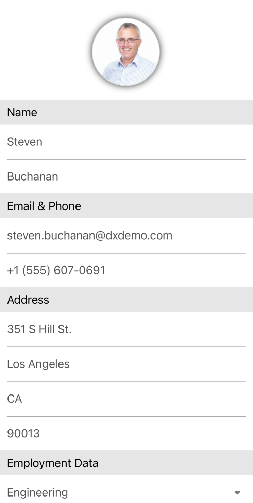

# Data Form for Xamarin.Forms

Files to look at:

- [MainPage.xaml](CS/DataForm/MainPage.xaml)
- [EmployeeInfo.cs](CS/DataForm/EmployeeInfo.cs)

This is the application created in the [Xamarin.Forms Data Form](https://www.youtube.com/watch?v=JdgzpUQR1GE) video that shows how to use the DevExpress [DataFormView](https://docs.devexpress.com/MobileControls/401732/xamarin-forms/data-form/index) component to create an edit form for a data object (*EmployeeInfo*).

